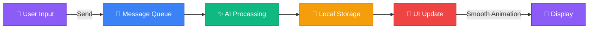

# ⚡ GEMINI CLONE — Premium Real-Time AI Chat Web App

<div align="center">


[](https://reactjs.org/)
[](https://clerk.com/)
[](LICENSE)
[](CONTRIBUTING.md)

### 🚀 *A stunning, production-ready AI chat application with zero backend complexity*

[✨ Live Demo](#) • [📖 Documentation](#) • [🐛 Report Bug](#) • [💡 Request Feature](#)

---

</div>

## 🎯 Project Overview

**Gemini Clone** is a **frontend-only**, premium AI chat application inspired by **Google Gemini**. Crafted with exceptional focus on **UI/UX**, **real-time chat experience**, and **modern authentication**, this project showcases how to build a high-quality AI platform using pure frontend technologies.

> 💡 **No Backend Required** — All authentication is handled by Clerk, and chat history persists locally with smart state management!

---

## ✨ Core Highlights

<table>
<tr>
<td align="center" width="25%">

<br><b>Frontend-Only</b>
<br><sub>Zero backend complexity</sub>
</td>
<td align="center" width="25%">

<br><b>Secure Auth</b>
<br><sub>Clerk integration</sub>
</td>
<td align="center" width="25%">

<br><b>Real-Time Chat</b>
<br><sub>Instant messaging</sub>
</td>
<td align="center" width="25%">

<br><b>PDF Export</b>
<br><sub>Save conversations</sub>
</td>
</tr>
</table>

<table>
<tr>
<td align="center" width="25%">

<br><b>Smart History</b>
<br><sub>Auto-save & restore</sub>
</td>
<td align="center" width="25%">

<br><b>Premium UI</b>
<br><sub>Gemini-inspired design</sub>
</td>
<td align="center" width="25%">

<br><b>Responsive</b>
<br><sub>Works everywhere</sub>
</td>
<td align="center" width="25%">

<br><b>Smooth Animations</b>
<br><sub>Delightful interactions</sub>
</td>
</tr>
</table>

---

## 🔐 Authentication System

<div align="center">

### Powered by **Clerk** 🛡️


</div>

| Feature | Description | Status |
|---------|-------------|--------|
| 📧 **Email & Password** | Traditional sign-in method | ✅ Implemented |
| 🔗 **Social Sign-In** | Google, GitHub, Twitter, etc. | ✅ Implemented |
| 🎨 **Beautiful UI** | Pre-built Clerk components | ✅ Implemented |
| 🔒 **Secure Sessions** | Enterprise-level security | ✅ Implemented |
| 🛡️ **Protected Routes** | No backend required | ✅ Implemented |

> 💎 **Why Clerk?** — Eliminates backend auth complexity while maintaining enterprise-level security!

---

## 🛠️ Tech Stack

<div align="center">

### Built with Modern Technologies

</div>

<table>
<tr>
<td align="center" width="33%">

#### 🎨 **Frontend**


</td>
<td align="center" width="33%">

#### 🔐 **Authentication**


</td>
<td align="center" width="33%">

#### 🔧 **Utilities**


</td>
</tr>
</table>

---

## 💬 Real-Time Chat System

<div align="center">

### 🚀 Lightning-Fast Messaging Experience

</div>



### ⚡ Features

- ✅ **Instant AI message rendering** with typing indicators
- ✅ **Auto-scroll** chat container for seamless experience
- ✅ **Smooth animations** on message appearance
- ✅ **Distinct message bubbles** for user & AI
- ✅ **Typing indicators** for realistic chat feel

---

## 🧠 Chat History Management

<div align="center">

### 📚 Never Lose Your Conversations


</div>

| Feature | Description |
|---------|-------------|
| 🕒 **Auto-Save** | Automatically saves every conversation |
| 💾 **Local Storage** | Persistent across browser sessions |
| 📂 **Organized Flow** | Clean message organization |
| 🔁 **Reload-Safe** | History restores on page refresh |
| ⚡ **Zero Backend** | Fully client-side and efficient |

---

## 📄 Download Chat History (PDF)

<div align="center">

### 💾 Export Your Conversations


</div>

**One-click download** converts complete conversations into clean PDF format:

✅ User messages with timestamps  
✅ AI responses formatted beautifully  
✅ Optional metadata (date, time)  
✅ Perfect for notes, study logs, or records

**Ideal Use Cases:**
- 📝 Study notes
- 📊 Meeting summaries
- 🎓 Learning logs
- 💼 Professional records

---

## 🎨 UI & UX Design

<div align="center">

### 🌟 Premium Dark Theme Inspired by Gemini

</div>

<table>
<tr>
<td width="50%">

#### 🎨 **Design Features**
- 🌙 Premium dark mode
- ✨ Gradient accents & glow effects
- 🎯 Minimal yet elegant layout
- 🔄 Smooth transitions
- 📱 Mobile-first responsive
- 💫 Animated interactions

</td>
<td width="50%">

#### 🎭 **Color Palette**
```css
Primary: #8B5CF6 (Purple)
Secondary: #3B82F6 (Blue)
Accent: #10B981 (Green)
Background: #1F2937 (Dark Gray)
Text: #F9FAFB (Light Gray)
```

</td>
</tr>
</table>

---

## 🚀 Complete Feature List

<div align="center">

### Everything You Need in One App

</div>

| Category | Features |
|----------|----------|
| 🤖 **Chat** | Real-time AI interface, typing indicators, smooth animations |
| 🔐 **Auth** | Clerk sign-in/sign-up, social login, session management |
| 🧠 **History** | Auto-save, local storage, reload persistence |
| 📄 **Export** | PDF download, formatted conversations, timestamps |
| 🎨 **UI/UX** | Dark mode, gradient effects, responsive design |
| ⚡ **Performance** | Fast rendering, smooth transitions, optimized storage |
| 📱 **Mobile** | Fully responsive, touch-friendly, adaptive layout |
| 🔒 **Security** | Protected routes, secure auth, data privacy |

---

## 📂 Project Structure

```
gemini-clone/
│
├── 📁 src/
│   ├── 📁 components/
│   │   ├── 💬 ChatInterface.jsx
│   │   ├── 🔐 AuthModal.jsx
│   │   ├── 📝 MessageBubble.jsx
│   │   └── 🎨 Sidebar.jsx
│   │
│   ├── 📁 context/
│   │   ├── 🔑 AuthContext.jsx
│   │   └── 💬 ChatContext.jsx
│   │
│   ├── 📁 pages/
│   │   ├── 🏠 Landing.jsx
│   │   ├── 💬 Chat.jsx
│   │   └── 👤 Profile.jsx
│   │
│   ├── 📁 assets/
│   │   ├── 🎨 styles/
│   │   └── 🖼️ images/
│   │
│   ├── 📁 utils/
│   │   ├── 💾 storage.js
│   │   └── 📄 pdfGenerator.js
│   │
│   ├── ⚛️ App.jsx
│   └── 🚀 main.jsx
│
├── 📁 public/
├── 📄 README.md
├── 📦 package.json
└── ⚙️ vite.config.js
```

---

### 🏠 Landing Page


*Beautiful hero section with animated gradients and CTAs*

---

### 🔐 Authentication UI


*Seamless sign-in experience with social login options*

---

### 💬 Chat Interface


*Stunning chat UI with smooth animations and typing indicators*

---

### 📄 PDF Export


*One-click download of complete chat history*

---

### 📱 Mobile Responsive


*Perfect experience across all devices*

</div>

---

## 🎯 Learning Outcomes

<table>
<tr>
<td width="50%">

### 🎓 **Technical Skills**
- ⚛️ Advanced React patterns
- 🎨 Modern CSS animations
- 💾 Client-side state management
- 🔐 Third-party auth integration
- 📄 Client-side PDF generation

</td>
<td width="50%">

### 💡 **Soft Skills**
- 🎨 UI/UX design principles
- 🏗️ Scalable architecture
- 📱 Responsive design thinking
- ⚡ Performance optimization
- 🔒 Security best practices

</td>
</tr>
</table>

---

## 🚀 Getting Started

<div align="center">

### Quick Setup in 3 Steps

</div>

```bash
# 1️⃣ Clone the repository
git clone https://github.com/yourusername/gemini-clone.git

# 2️⃣ Install dependencies
cd gemini-clone
npm install

# 3️⃣ Add your Clerk API keys
# Create .env file and add:
# VITE_CLERK_PUBLISHABLE_KEY=your_key_here

# 4️⃣ Start the development server
npm run dev
```

<div align="center">

🎉 **That's it!** Open `http://localhost:5173` and start chatting!

</div>

---

## 🌟 Key Features Breakdown

### 1️⃣ **Frontend-Only Architecture**
```
✅ No server setup required
✅ Deploy anywhere (Vercel, Netlify, GitHub Pages)
✅ Instant development setup
✅ Cost-effective hosting
```

### 2️⃣ **Clerk Authentication**
```
✅ Enterprise-grade security
✅ Beautiful pre-built UI
✅ Multiple auth providers
✅ Session management
```

### 3️⃣ **Real-Time Chat Experience**
```
✅ Instant message rendering
✅ Typing indicators
✅ Smooth animations
✅ Auto-scroll functionality
```

### 4️⃣ **Smart Persistence**
```
✅ Local storage integration
✅ Auto-save on every message
✅ Reload-safe history
✅ Export functionality
```

---

**[⬆ Back to Top](#-gemini-clone--premium-real-time-ai-chat-web-app)**

---

© 2026 Gemini Clone. All rights reserved.

</di
